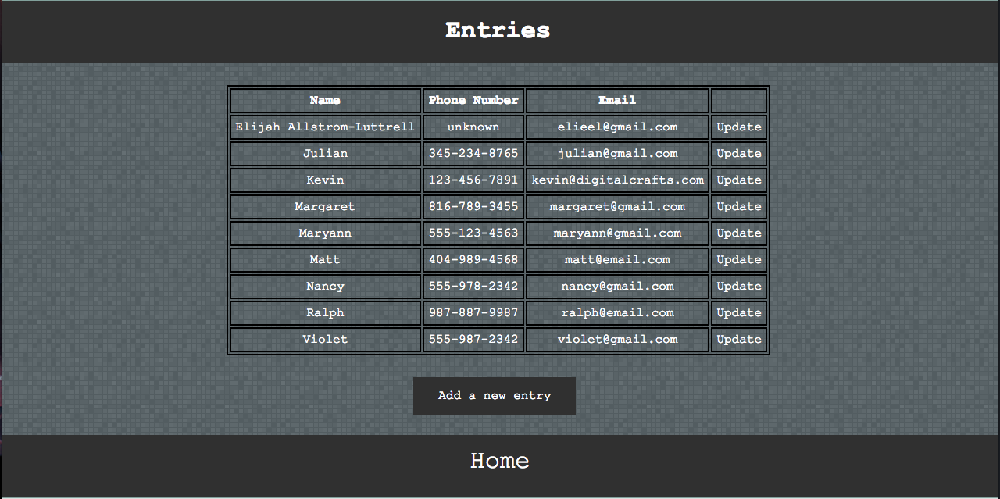
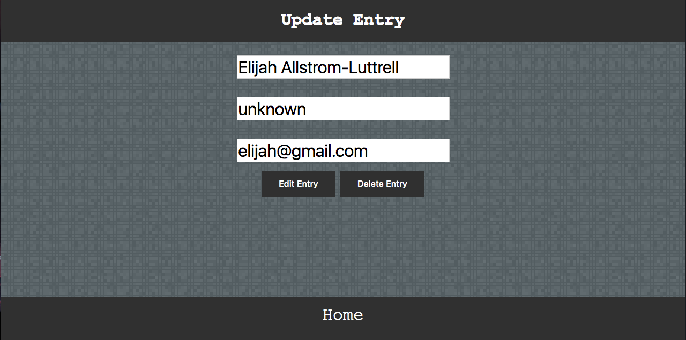
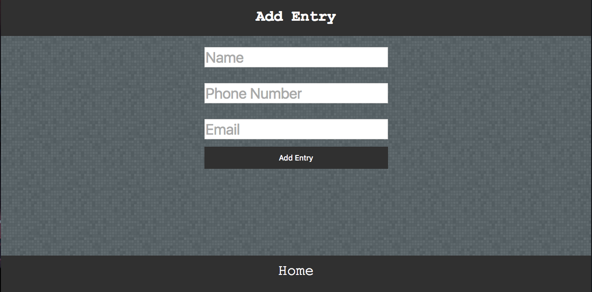

# Phonebook_v4
This was a project we built several times over using different methods each time.
This implementation was done using Python and PostgreSql, Flask, and Jinja templating along with HTML/CSS.

Information can be entered and it will be stored in a PostgreSQL database, and is also editable/deletable from the website.

I am currently in the process of deploying it to AWS through an ubuntu apache server.

## Demo
There is not a live demo available yet, but here are some screen shots:
### Homepage

### Edit page

### Add Entry page

